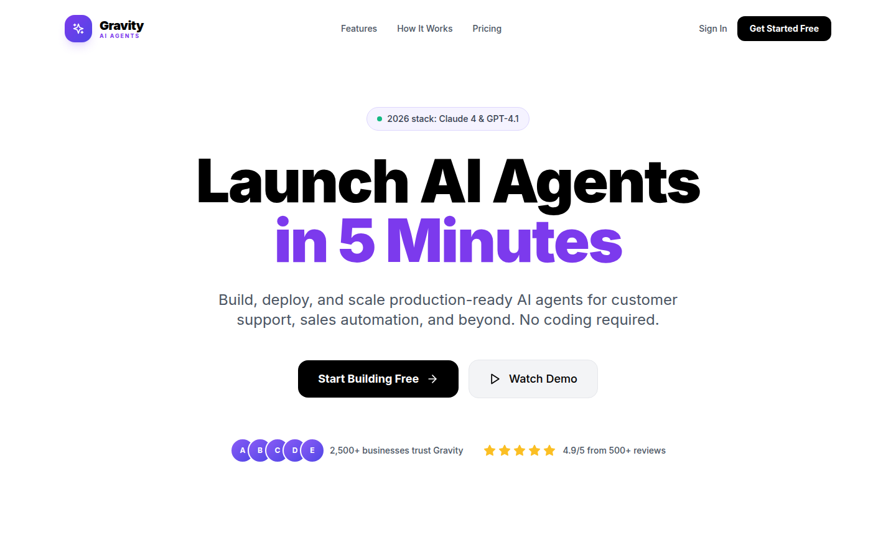
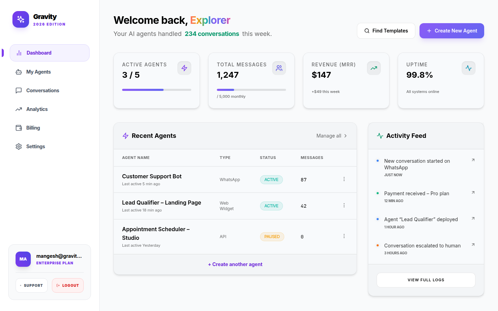
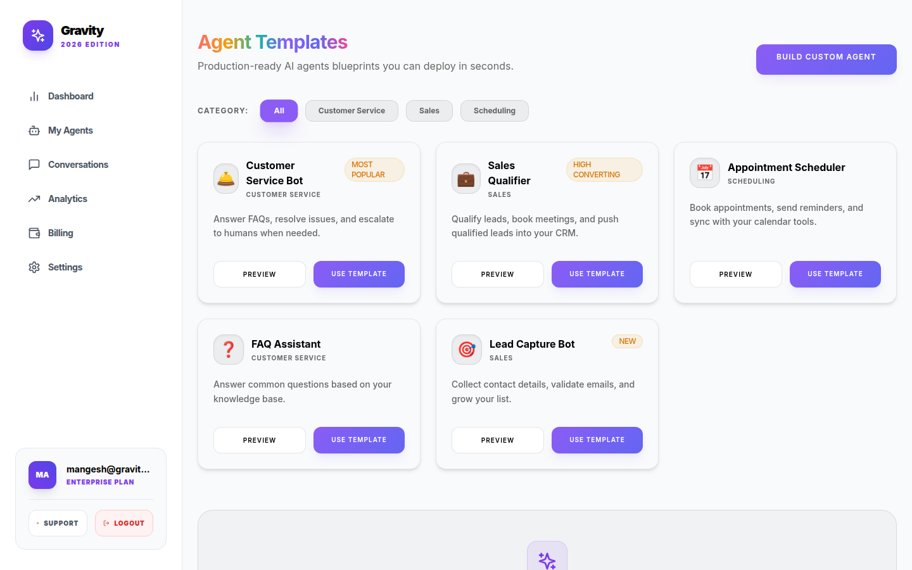
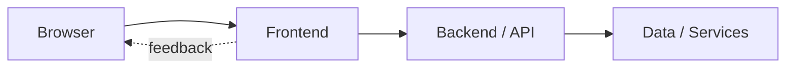

<div align="center">
  
# ⚡ Gravity AI Agent Platform

**Production-ready multi-tenant SaaS platform for deploying AI agents across multiple channels**

[](https://opensource.org/licenses/MIT)
[](https://nextjs.org/)
[](https://www.typescriptlang.org/)
[](https://github.com/mangeshraut712/Gravity-SaaS-Agent/actions)

[Features](#-features) • [Quick Start](#-quick-start) • [Documentation](#-documentation) • [Architecture](#-architecture) • [Contributing](#-contributing)

<br />



<p>

&nbsp;

</p>

<sub>Captured from the running Next.js dashboard (landing, operator home, template library).</sub>

</div>

---

## 📖 Overview

Gravity is a **production-ready, multi-tenant AI agent SaaS platform** that enables businesses to deploy branded AI agents across web chat, WhatsApp, Telegram, and custom API channels. Built with Next.js 15, Express, and Supabase, it provides everything you need to launch and scale an AI agent business.

### 🎯 Perfect For

- 🏢 **Agencies** building AI solutions for clients
- 💼 **SaaS Founders** launching AI agent products
- 🚀 **Startups** automating customer service
- 👨‍💻 **Developers** learning modern SaaS architecture

---

## ✨ Features

### 🤖 AI Agent Management

- **Template Library** - Pre-built agents for common use cases (Customer Support, Sales, FAQ, Appointments)
- **Custom Agents** - Build agents with custom prompts, knowledge bases, and behaviors
- **Multi-Model Support** - Claude 4, GPT-4.1, and OpenRouter integration
- **Context Management** - Advanced conversation memory and context handling
- **Skills System** - Extensible skill framework (web search, file management, integrations)

### 💬 Multi-Channel Deployment

- **Web Chat** - Embeddable chat widget with customizable branding
- **WhatsApp Business** - Deploy to WhatsApp Business API
- **Telegram Bots** - Native Telegram bot integration
- **Slack Integration** - Deploy to Slack workspaces
- **REST API** - Custom integrations via comprehensive API

### 💳 Monetization & Billing

- **Subscription Tiers** - Free, Pro ($49/mo), Business ($199/mo)
- **Usage Tracking** - Message limits, agent counts, channel access
- **Polar.sh Integration** - Seamless billing and subscription management
- **Usage Analytics** - Real-time usage monitoring and alerts
- **Webhook Events** - Subscription lifecycle notifications

### 📊 Analytics & Insights

- **Real-time Dashboard** - Live metrics and conversation monitoring
- **Performance Analytics** - Response times, resolution rates, satisfaction scores
- **Usage Reports** - Daily, weekly, monthly usage breakdowns
- **Revenue Tracking** - MRR, churn, LTV metrics
- **Custom Charts** - Interactive data visualization with Recharts

### 🔐 Enterprise Security

- **JWT Authentication** - Secure token-based auth with refresh
- **Row Level Security** - Database-level access control via Supabase RLS
- **Rate Limiting** - Tier-based rate limits (Free: 10 req/min, Pro: 100 req/min, Business: 1000 req/min)
- **Input Validation** - Comprehensive request validation and sanitization
- **Security Headers** - Helmet.js, CSP, HSTS, CORS configuration
- **API Key Management** - Secure API key generation and rotation

### ⚡ Performance Optimizations

- **Two-Tier Caching** - LRU in-memory cache + Redis for distributed caching
- **Bundle Optimization** - Webpack vendor chunks (~400KB), code splitting
- **Static Generation** - 16 pages pre-rendered at build time
- **Image Optimization** - WebP/AVIF with Next.js Image component
- **Compression** - Gzip/Brotli compression enabled
- **CDN Ready** - Optimized for CloudFront/Vercel Edge Network

---

## 🎨 UI/UX Design (2026 Edition)

The dashboard features a **modern 2026-style design** with:

### ✨ Design Highlights

- **Clean White Theme** - Solid white backgrounds with black text for maximum readability
- **Violet Accents** - Consistent violet-600 color for buttons, links, and active states
- **Glassmorphic Elements** - Subtle glass effects on cards and modals
- **Premium Typography** - Inter font with proper hierarchy and tracking
- **Smooth Animations** - Framer Motion-powered micro-interactions
- **Responsive Layout** - Mobile-first design with adaptive components

### 📱 Pages Included

| Page | Description |
|------|-------------|
| **Landing Page** | Marketing homepage with hero, features, pricing |
| **Login/Signup** | Clean authentication forms with OAuth support |
| **Dashboard** | Metrics overview with activity feed |
| **Agents** | Agent management with CRUD operations |
| **Agent Builder** | Multi-step wizard for creating AI agents |
| **Analytics** | Charts and performance metrics |
| **Billing** | Subscription management portal |
| **Settings** | User preferences and account settings |

---

## 🏗️ Architecture

```
┌──────────────────────────────────────────────────────────────┐
│                  Dashboard (Next.js 15)                      │
│  ┌────────────┬──────────────┬──────────────┬─────────────┐ │
│  │  Landing   │ Auth (JWT)   │ Agent Builder│  Analytics  │ │
│  │   Pages    │ Supabase Auth│  Templates   │  Dashboards │ │
│  └────────────┴──────────────┴──────────────┴─────────────┘ │
│  ┌────────────────────────────────────────────────────────┐ │
│  │        Chat Widget • Billing Portal • Settings         │ │
│  └────────────────────────────────────────────────────────┘ │
└──────────────────┬───────────────────────────────────────────┘
                   │ REST API / WebSocket
┌──────────────────▼───────────────────────────────────────────┐
│                   Gateway API (Express)                      │
│  ┌────────────┬──────────────┬──────────────┬─────────────┐ │
│  │  Channel   │ Rate Limiter │ Skills Engine│   Caching   │ │
│  │  Adapters  │ Circuit Break│ MCP Client   │ Redis + LRU │ │
│  └────────────┴──────────────┴──────────────┴─────────────┘ │
│  ┌────────────────────────────────────────────────────────┐ │
│  │  WhatsApp • Telegram • Slack • Custom Channels         │ │
│  └────────────────────────────────────────────────────────┘ │
└──────────────────┬───────────────────────────────────────────┘
                   │
┌──────────────────▼───────────────────────────────────────────┐
│               Supabase (PostgreSQL + Auth)                   │
│  ┌────────────┬──────────────┬──────────────┬─────────────┐ │
│  │   Users    │    Agents    │Conversations │  Messages   │ │
│  │  Profiles  │   Templates  │   Sessions   │  Events     │ │
│  └────────────┴──────────────┴──────────────┴─────────────┘ │
│  ┌────────────────────────────────────────────────────────┐ │
│  │     Analytics Events • Billing Events • RLS Policies   │ │
│  └────────────────────────────────────────────────────────┘ │
└──────────────────────────────────────────────────────────────┘
```

### Tech Stack

#### Frontend (Dashboard)
- **Framework:** Next.js 15 (App Router)
- **UI:** React 18, Tailwind CSS, Radix UI
- **State:** Zustand, TanStack Query
- **Charts:** Recharts
- **Animations:** Framer Motion
- **Icons:** Lucide React

#### Backend (Gateway)
- **Runtime:** Node.js 18+
- **Framework:** Express.js
- **Language:** TypeScript 5.0
- **Caching:** Redis (ioredis) + LRU
- **Logging:** Winston
- **Security:** Helmet, CORS, Rate Limiting

#### Database & Auth
- **Database:** Supabase (PostgreSQL)
- **Auth:** Supabase Auth + JWT
- **Storage:** Supabase Storage
- **RLS:** Row Level Security enabled

#### AI/LLM
- **Primary:** Anthropic Claude 4
- **Fallback:** OpenRouter (multiple models)
- **Optional:** OpenAI GPT-4.1

#### DevOps
- **CI/CD:** GitHub Actions
- **Containers:** Docker + Docker Compose
- **Hosting:** Vercel (Dashboard), Railway (Gateway)
- **Monitoring:** Sentry (optional)

---

## 🚀 Quick Start

### Prerequisites

- Node.js 18+ and npm
- Supabase account ([free tier](https://supabase.com))
- Anthropic API key ([get one](https://console.anthropic.com))
- Polar.sh account ([optional](https://polar.sh))

### Installation

```bash
# Clone the repository
git clone https://github.com/mangeshraut712/Gravity-SaaS-Agent.git
cd Gravity-SaaS-Agent

# Install dependencies
npm install

# Set up environment variables
cp .env.example .env
# Edit .env with your credentials (see detailed guide below)
```

### Environment Setup

Create `.env` in the project root:

```bash
# Database (Required)
NEXT_PUBLIC_SUPABASE_URL=https://your-project.supabase.co
NEXT_PUBLIC_SUPABASE_ANON_KEY=your-anon-key
SUPABASE_SERVICE_ROLE_KEY=your-service-role-key

# AI Provider (Required)
ANTHROPIC_API_KEY=sk-ant-xxxxx

# Security (Required)
JWT_SECRET=generate-a-strong-random-secret-min-32-chars

# Billing (Optional - for subscription features)
POLAR_PRO_PRODUCT_ID=prod_xxxxx
POLAR_BUSINESS_PRODUCT_ID=prod_xxxxx

# Caching (Optional - falls back to in-memory if not set)
REDIS_URL=redis://localhost:6379
```

> 📝 **See [`.env.example`](.env.example) for all available options (100+ environment variables)**

### Database Setup

1. **Create Supabase Project**
   - Go to [Supabase Dashboard](https://app.supabase.com)
   - Create new project
   - Copy URL and API keys to `.env`

2. **Run Database Schema**
   ```bash
   # Copy the SQL from supabase/schema.sql
   # Paste and run in Supabase SQL Editor
   ```

### Start Development

```bash
# Start both dashboard and gateway
npm run dev

# Or start individually
npm run dev:dashboard  # Dashboard on http://localhost:3000
npm run dev:gateway    # Gateway on http://localhost:3003
```

**That's it!** 🎉 No Docker required for development.

### Access the Application

- **Dashboard:** http://localhost:3000
- **Gateway API:** http://localhost:3003
- **Health Check:** http://localhost:3003/health

---

## 📁 Project Structure

```
Gravity-SaaS-Agent/
├── apps/
│   ├── dashboard/              # Next.js frontend application
│   │   ├── src/
│   │   │   ├── app/           # App Router pages & API routes
│   │   │   │   ├── (auth)/   # Auth pages (login, signup)
│   │   │   │   ├── agents/   # Agent management
│   │   │   │   ├── analytics/ # Analytics dashboard
│   │   │   │   ├── billing/  # Subscription management
│   │   │   │   └── api/      # API routes
│   │   │   ├── components/   # React components
│   │   │   │   └── ui/       # Reusable UI components
│   │   │   ├── lib/          # Utilities & clients
│   │   │   ├── hooks/        # Custom React hooks
│   │   │   └── styles/       # Global styles
│   │   └── public/           # Static assets
│   │
│   └── gateway/               # Express backend server
│       ├── src/
│       │   ├── services/     # Business logic
│       │   ├── middleware/   # Express middleware
│       │   ├── adapters/     # Channel adapters
│       │   └── routes/       # API routes
│       └── Dockerfile
│
├── packages/                  # Shared packages
│   ├── types/                # TypeScript definitions
│   ├── db/                   # Database utilities
│   ├── memory/               # Memory management
│   └── mcp-client/           # MCP client
│
├── supabase/
│   └── schema.sql            # Database schema & RLS policies
│
├── docs/                     # Documentation
│   ├── screenshots/         # Product screenshots (README / portfolio)
│   ├── DEPLOYMENT.md         # Deployment guides
│   └── IMPROVEMENTS.md       # Recent improvements
│
├── .github/
│   ├── workflows/           # GitHub Actions
│   └── ISSUE_TEMPLATE/      # Issue templates
│
├── docker-compose.yml        # Multi-container orchestration
├── CONTRIBUTING.md          # Contributor guidelines
├── SECURITY.md              # Security policy
└── LICENSE                  # MIT License
```

---

## 📊 Subscription Plans

| Feature | Free | Pro | Business |
|---------|------|-----|----------|
| **Price** | $0/mo | $49/mo | $199/mo |
| **Agents** | 1 | 5 | Unlimited |
| **Messages/Month** | 100 | 5,000 | 50,000 |
| **Channels** | Web Only | All Channels | All Channels |
| **Branding** | "Powered by Gravity" | White-label | White-label |
| **API Access** | ❌ | ✅ | ✅ |
| **Custom Domain** | ❌ | ✅ | ✅ |
| **Priority Support** | ❌ | ✅ | ✅ Dedicated |
| **SLA** | ❌ | ❌ | 99.9% |
| **Custom Integrations** | ❌ | ❌ | ✅ |

---

## 🛠️ Available Scripts

### Development
```bash
npm run dev              # Start both dashboard & gateway with colored output
npm run dev:dashboard    # Start only dashboard (localhost:3000)
npm run dev:gateway      # Start only gateway (localhost:3003)
```

### Building
```bash
npm run build            # Build all workspaces
npm run build:dashboard  # Build dashboard only
npm run build:gateway    # Build gateway only
```

### Testing
```bash
npm test                 # Run all tests
npm run test:watch       # Run tests in watch mode
npm run test:coverage    # Generate coverage report
npm run test:ci          # Run tests in CI mode
```

### Code Quality
```bash
npm run lint             # Lint all workspaces
npm run lint:fix         # Auto-fix linting issues
npm run typecheck        # TypeScript type checking
npm run format           # Format code with Prettier
npm run format:check     # Check code formatting
npm run validate         # Run typecheck + lint + test
```

### Maintenance
```bash
npm run clean            # Remove all build artifacts & node_modules
npm run clean:cache      # Clear Next.js and build caches
```

### Docker
```bash
npm run docker:build     # Build Docker images
npm run docker:up        # Start containers
npm run docker:down      # Stop containers
npm run docker:logs      # View logs
npm run docker:restart   # Restart services
```

---

## 🌐 API Endpoints

### Dashboard API (Next.js)

#### Chat
```bash
POST /api/chat/:agentId
Content-Type: application/json

{
  "message": "Hello, how can I help?",
  "conversationId": "optional-conversation-id"
}
```

#### Webhooks
```bash
POST /api/webhooks/polar      # Polar.sh billing events
```

### Gateway API (Express)

```bash
# Health & Monitoring
GET  /health                   # Health check
GET  /stats                    # System statistics

# Skills
GET  /api/skills               # List available skills
POST /api/skills/:id/execute   # Execute a skill

# Channels
GET  /api/channels             # Channel status
POST /api/channels/:type/send  # Send message via channel

# Chat
POST /api/chat                 # Chat with AI (OpenRouter)
```

---

## 🚢 Deployment

### Quick Deploy

#### Vercel (Dashboard) - Recommended
[](https://vercel.com/new/clone?repository-url=https://github.com/mangeshraut712/Gravity-SaaS-Agent)

#### Railway (Gateway) - Recommended
[](https://railway.app/new)

### Other Options

- **Docker:** See [Docker Deployment](#docker-deployment)
- **AWS:** See [docs/DEPLOYMENT.md](docs/DEPLOYMENT.md#deploy-to-aws)
- **Self-Hosted:** See [docs/DEPLOYMENT.md](docs/DEPLOYMENT.md)

### Docker Deployment

```bash
# Production deployment with Docker Compose
docker-compose up -d

# Services:
# - Dashboard: http://localhost:3000
# - Gateway: http://localhost:3003
# - Redis: localhost:6379 (optional)
```

> 📖 **Full deployment guide:** [docs/DEPLOYMENT.md](docs/DEPLOYMENT.md)

---

## 📚 Documentation

| Document | Description |
|----------|-------------|
| [**CONTRIBUTING.md**](CONTRIBUTING.md) | How to contribute to the project |
| [**DEPLOYMENT.md**](docs/DEPLOYMENT.md) | Comprehensive deployment guide |
| [**SECURITY.md**](SECURITY.md) | Security policy & vulnerability reporting |
| [**IMPROVEMENTS.md**](docs/IMPROVEMENTS.md) | Recent improvements & changelog |
| [**.env.example**](.env.example) | All environment variables explained |

---

## 🧪 Testing

```bash
# Run all tests
npm test

# Watch mode for development
npm run test:watch

# Generate coverage report
npm run test:coverage

# Run specific workspace tests
npm test -w @gravity/gateway
npm test -w @gravity/dashboard
```

---

## 🤝 Contributing

We welcome contributions! Please see our [Contributing Guide](CONTRIBUTING.md) for details.

### Quick Contribution Guide

1. **Fork the repository**
2. **Create a feature branch**
   ```bash
   git checkout -b feature/amazing-feature
   ```
3. **Make your changes**
4. **Run validation**
   ```bash
   npm run validate
   ```
5. **Commit with conventional commits**
   ```bash
   git commit -m "feat: add amazing feature"
   ```
6. **Push and create PR**
   ```bash
   git push origin feature/amazing-feature
   ```

### Development Guidelines

- ✅ Write tests for new features
- ✅ Follow TypeScript best practices
- ✅ Use Prettier for formatting
- ✅ Follow conventional commits
- ✅ Update documentation
- ✅ Ensure CI passes

---

## 🔒 Security

Security is a top priority. Please see our [Security Policy](SECURITY.md) for:

- Reporting vulnerabilities
- Security best practices
- Response timelines
- Known security features

**Found a security issue?** Email: **security@gravity.ai**

---

## 📄 License

This project is licensed under the **MIT License** - see the [LICENSE](LICENSE) file for details.

---

## 🙏 Acknowledgments

Built with amazing open-source technologies:

- [Next.js](https://nextjs.org/) - React framework
- [Supabase](https://supabase.com/) - Backend as a Service
- [Anthropic](https://www.anthropic.com/) - Claude AI
- [Radix UI](https://www.radix-ui.com/) - UI components
- [Tailwind CSS](https://tailwindcss.com/) - Styling
- [Polar.sh](https://polar.sh/) - Billing

---

## 📞 Support & Community

- **GitHub Issues:** [Report bugs or request features](https://github.com/mangeshraut712/Gravity-SaaS-Agent/issues)
- **Discussions:** [Ask questions & share ideas](https://github.com/mangeshraut712/Gravity-SaaS-Agent/discussions)
- **Email:** dev@gravity.ai
- **Twitter:** [@GravityAI](https://twitter.com/gravityai)

---

## 🗺️ Roadmap

### Q1 2026
- [ ] Voice agent support
- [ ] Multi-language support
- [ ] Advanced analytics
- [ ] Plugin marketplace

### Q2 2026
- [ ] Mobile apps (iOS/Android)
- [ ] Enterprise SSO
- [ ] Advanced RBAC
- [ ] White-label customization

### Q3 2026
- [ ] AI agent training interface
- [ ] Knowledge base builder
- [ ] A/B testing framework
- [ ] Advanced workflow builder

---

## ⭐ Star History

[](https://star-history.com/#mangeshraut712/Gravity-SaaS-Agent&Date)

---

## 📈 Status


---

<div align="center">

**Built with ❤️ by the Gravity Team**

[⬆ Back to Top](#-gravity-ai-agent-platform)

</div>

---

<!-- codex:project-diagram:start -->

## Project Diagram



_Main application path from user interface through backend services._

<!-- codex:project-diagram:end -->
